### Requirements
- 🔗 [VS Code](https://code.visualstudio.com/)
- 🔗 [Remote Development](https://marketplace.visualstudio.com/items?itemName=ms-vscode-remote.vscode-remote-extensionpack) Extension
- 🔗 [Python](https://marketplace.visualstudio.com/items?itemName=ms-python.python) Extension
- 🔗 [Remote Explorer](https://marketplace.visualstudio.com/items?itemName=ms-vscode.remote-explorer) Extension
- 🔗 [Runpod](https://www.runpod.io/) Account
- 🔗 Runpod [Network Volume](https://docs.runpod.io/docs/create-a-network-volume)
- GNU/Linux or MacOS 

## Tutorial

### Connecting VS Code To Your Pod

1. Start a network volume with RunPod VS Code Server template 
<details>
<summary>click to expand image</summary>
   
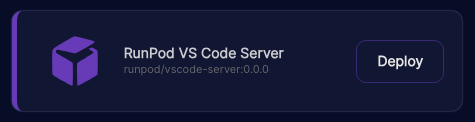
</details>

2. Open a new window in VS Code and select the Remote Explorer extension.
<details>
<summary>click to expand image</summary>
   
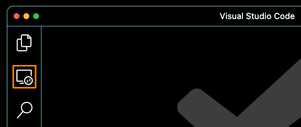
</details>

3. Select `Remotes (Tunnels/SSH)` from the dropdown menu
<details>
<summary>click to expand image</summary>


</details>

4. Hover over the SSH voice until a cog appears and click on it.
<details>
<summary>click to expand image</summary>
   
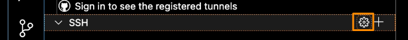
</details>

5. From the voices in the dropdown select: `/Users/<user>/.ssh/config`
<details>
<summary>click to expand image</summary>
   
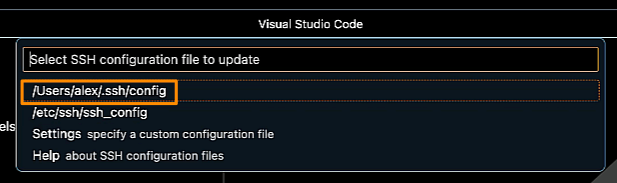
</details>

6. Navigate to `https://www.runpod.io/console/pods` and click on the **Connect** button of your running pod instance.
<details>
<summary>click to expand image</summary>
   
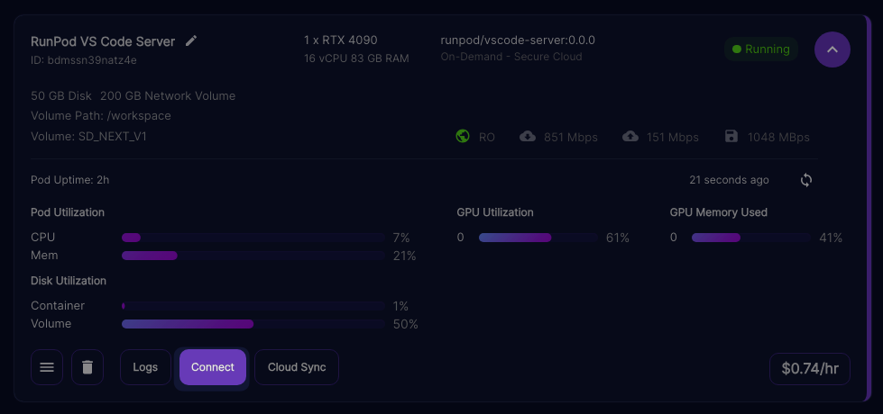
</details>


7. From the `Connection Options` tab, copy the exposed TCP **IP** and **port number**.
<details>
<summary>click to expand image</summary>
   
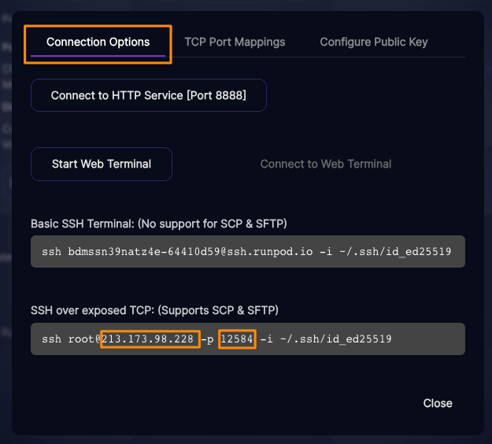
</details>

8. Paste the copied data into the appropriate fields, within the `/Users/<user>/.ssh/config` file opened previously

```
# Read more about SSH config files: https://linux.die.net/man/5/ssh_config
Host <any_name_of_your_choice_here>
    HostName <PASTE-IP-HERE>
    Port <PASTE-PORT-HERE>
    User root
```

6. Save with `⌘ + s` or `⌃ + s` 

7. Steps 4 to 6 will have to be repeated each time you spin up a new pod, which will have different SSH connection 
details

### Generating SSH Certificate

We will use the UNIX `ssh-keygen` command to generate an SSH key. `ssh-keygen` is a component of the Secure Shell (SSH)
protocol suite used to generate, manage, and convert authentication keys

1. Navigate to `https://www.runpod.io/console/pods` and click on the **Connect** button of your running pod instance.
<details>
<summary>click to expand image</summary>
   

</details>

2. From the Connection Options tab, copy the entire command
<details>
<summary>click to expand image</summary>
   
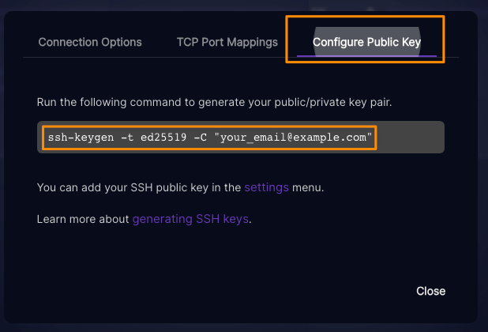
</details>

3. Open a terminal on your computer or within VS Code and paste the command adding your own email address.  Press enter and add your password when required to do so.

```
ssh-keygen -t keytype -C "your_email@domain.com"
```

4. Between the lines printed by the shell, you'll see one saying: Your public key has been saved in 
`/Users/<username>/.ssh/<filename>.pub`. Copy the indicated path.

<details>
<summary>click to expand image</summary>
   
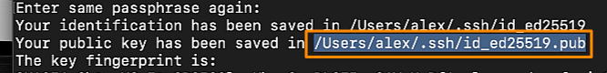
</details>

5. A full connection command will also be printed out, copy that too
<details>
<summary>click to expand image</summary>
   
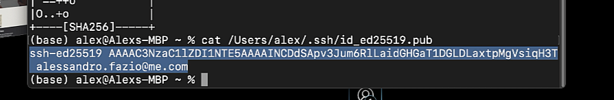
</details>

6. Navigate to `https://www.runpod.io/console/user/settings` > `Settings` > `SSH Public Keys`. Paste the key previously 
copied and click `Update Public Key`.
<details>
<summary>click to expand image</summary>
   
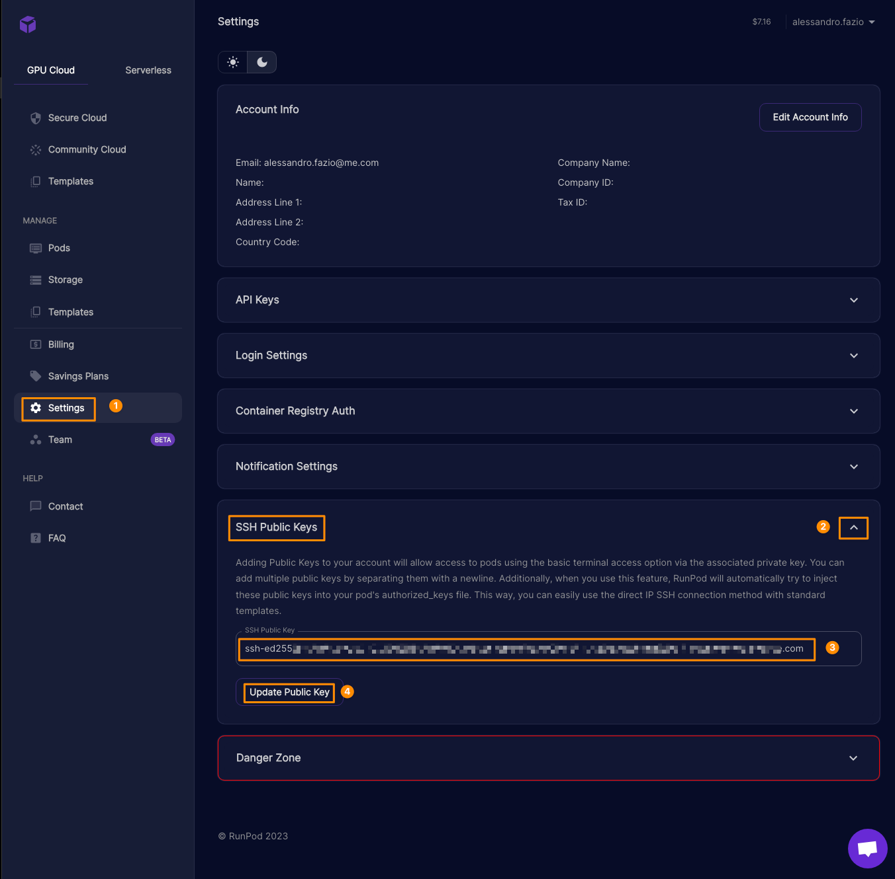
</details>

7. Back in VS code, close the current window entirely and open a new one. Then open the Remote Explorer extension and reconnect to the server by pressing on the arrow on its right side. If you encounter any connection issues at this point,
it normally helps to trash the pod entirely and create a new one. Once the new pod is running, you'll only have to update
the connection details in `/Users/<user>/.ssh/config` (see step 7 of Connecting VS Code To Your Pod).

<details>
<summary>click to expand image</summary>
   
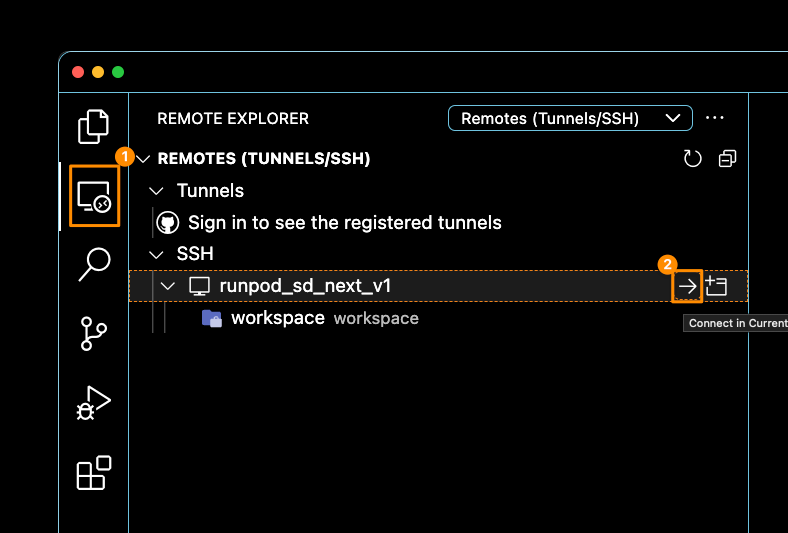
</details>


8. Navigate to `https://www.runpod.io/console/pods` and click on the **Connect** button of your running pod instance.
<details>
<summary>click to expand image</summary>
   

</details>


9. From the `Connection Options` tab, copy the entire command for `SSH over exposed TCP: (Supports SCP & SFTP)`.
<details>
<summary>click to expand image</summary>
   
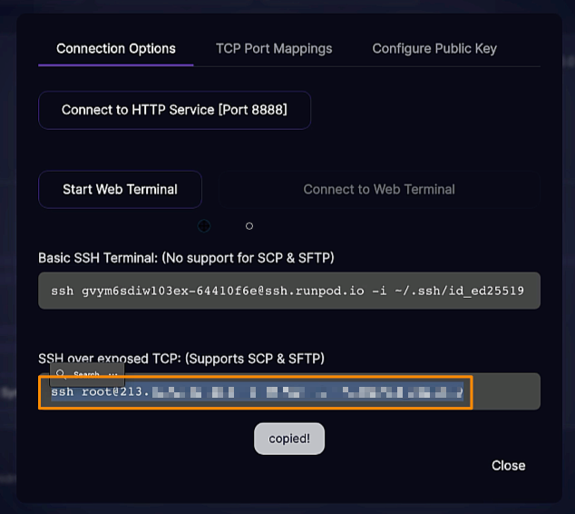
</details>

10. Open a terminal on your computer or within VS Code and paste the command copied previously.  
Press enter and type yes when asked: `Are you sure you want to continue connecting...`. 
Add a custom passphrase for key when required to do so. **Please store this password securely somewhere.**
You'll be asked this password every time you connect to a server with the current template.

```
ssh user@XXX.XXX.XXX.XXX -p XXXXX -i ~/.ssh/id keytype
```

7. Back in VS code, close the current window entirely and open a new one. Then open the Remote Explorer extension and 
reconnect to the server by pressing on the arrow on its right side. (see step 7 of Generating SSH Certificate)
When prompted, enter the reqruired passkey we just used within the system Terminal.
After entering the passkey, you'll be finally connected to your Vs Code Server.

<details>
<summary>click to expand image</summary>
   
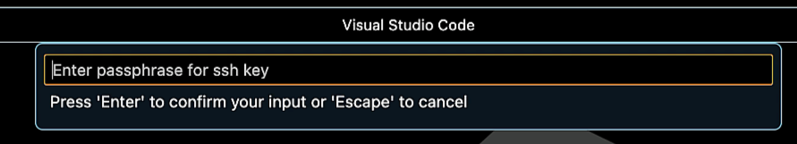
</details>

_If you encounter any connection issues at this point,
it normally helps to trash the pod entirely and create a new one. Once the new pod is running, you'll only have to update
the connection details in `/Users/<user>/.ssh/config` (see step 7 of Connecting VS Code To Your Pod)._

### Installing Automatic1111

8. Once connected open a terminal within VS Code by pressing `⇧ + ⌘ + P` or `⇧ + ⌘ + P` and typing `Create New Terminal`.

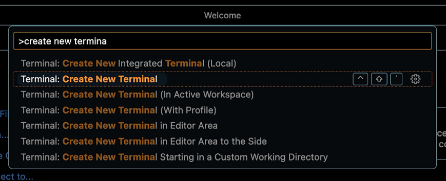

9. Once the terminal is open, type `cd /workspace`

10. Navigate to Automatic1111 GitHub repository `https://github.com/AUTOMATIC1111/stable-diffusion-webui` and copy the .git URL 
<details>
<summary>click to expand image</summary>
   
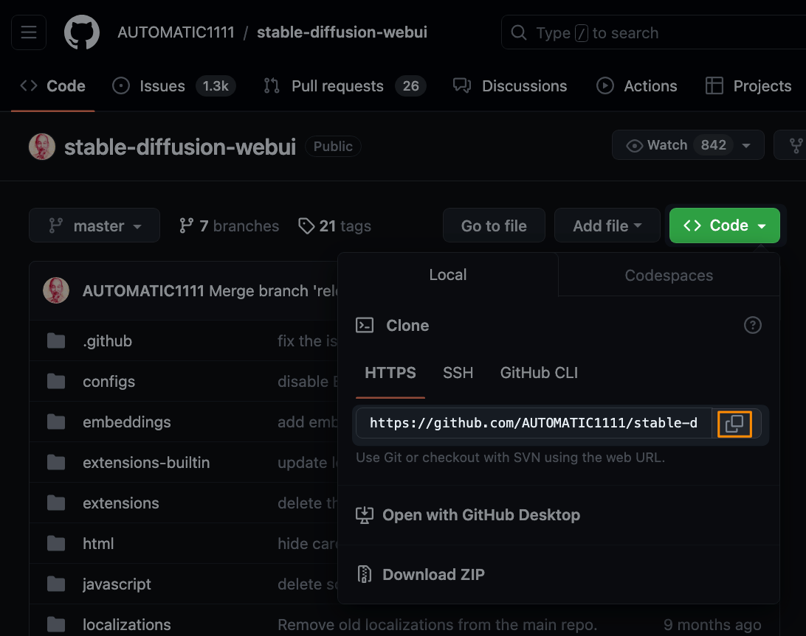
</details>

11. Within the VS Code terminal type `git clone https://github.com/AUTOMATIC1111/stable-diffusion-webui` and press `⏎`

12. Once the cloning is completed type cd `/workspace/stable-diffusion-webui` and press `⏎`. 
Then type `./webui.sh` to start the application. 
As this is a first time start, requiring several installations, it will take a while. So sit back or grab a coffee.
If prompted to `Download the default model? (y/N)` type `y`.

13. Type `vim /workspace/entrypoint.sh ` and press `⏎`. 
Paste the following with `⌃ + V` or `⌘ + V`
```
#!/usr/bin/env bash

# Update package lists
apt update

# Install required packages
apt install -y ffmpeg libsm6 libxext6 tmux rsync vim htop zip

# Install and upgrade gdown
pip install --upgrade gdown

# Tmux mouse support configuration
echo "set -g mouse on" > ~/.tmux.conf
```
Then type `:wq` (copy pasting might not work) followed by `⏎`.

14. Type `cd /workspace` to navigate to the workspace folder once again.

15. Type the command `chmod +x entrypoint.sh` followed by `⏎`. This command modifies the permissions of the file 
`entrypoint.sh` to make it executable.

13. Type `vim /workspace/boot.sh ` and press `⏎`. 
Paste the following with `⌃ + V` or `⌘ + V`
```
#!/usr/bin/env bash

# starts AUTOMATIC1111 webui
# to make this executable 👉 chmod +x boot.sh
# to execute boot.sh 👉 ./boot.sh

# Update package lists
apt update

# Navigate to the webui directory
cd /workspace/stable-diffusion-webui

# Install required packages to fix AttributeError
apt install -y ffmpeg libsm6 libxext6

# Start the webui
./webui.sh
```
Then type `:wq` (copy pasting might not work) followed by `⏎`.

16. Type `./entrypoint.sh` followed by `⏎`.
The script performs the following actions:
Updates the package lists on a system using the `apt` package manager.
* Installs several packages, including multimedia processing tools (`ffmpeg`), libraries (`libsm6`, `libxext6`), 
system utilities (`tmux`, `rsync`, `htop`, `psmisc`), a text editor (`vim`), and a compression tool (`zip`).
* Installs and upgrades the `gdown` tool using `pip`, which is used for downloading files from Google Drive.
* Configures `tmux` (a terminal multiplexer) to support mouse interactions by creating or updating the `~/.tmux.conf` file.
* Starts the webui by calling ./boot.sh

17. At this point you should have received a notification within VS Code allowing you to open your instance of 
AUTOMATIC111 via web browser. By clicking on ... you'll be bable to access your machine. If this is not the case, check
within the ports tab, for open ports. And by clicking on the globe icon, you'll access your machine.

<details>
<summary>click to expand image</summary>
   
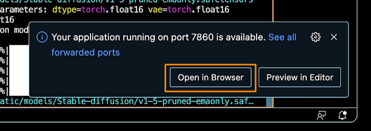
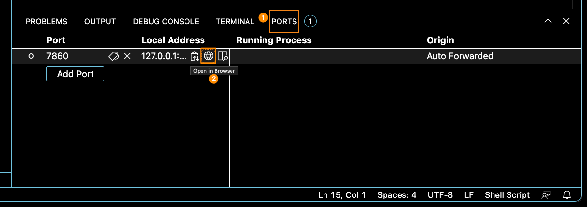
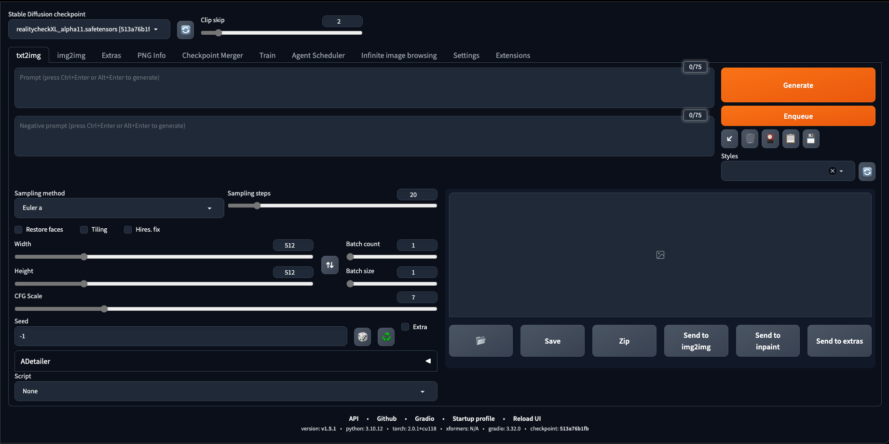
</details>

### Installing Models

1. Open a terminal in VS Code pressing `⌃ + ⇧ + ` and type: `/workspace/stable-diffusion-webui/models` to navigate to the models folder.

2. In your web browser, navigate to a `.safetensors` model web page of your choice and grab the download URL.

3. In VS Code terminal, type `wget <URL>> --content-disposition` to download the model to your current folder.

4. When the download is complete, simply refresh your checkpoints selector to have the model avilable in A1111.
<details>
<summary>click to expand image</summary>
   
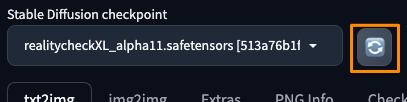
</details>

### Shutdown and Boot

### Installing multiple GUIs


